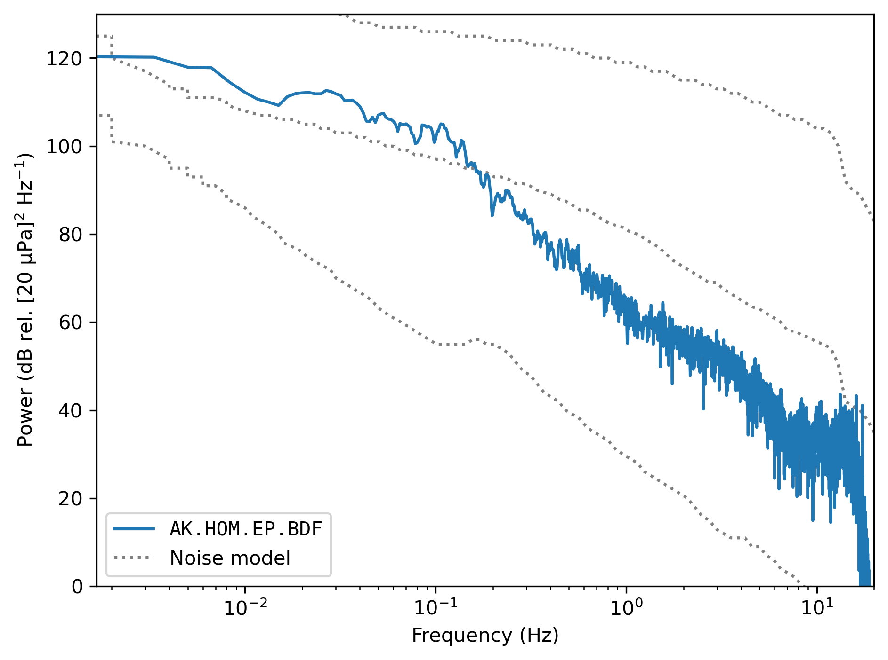

# SAUL

**SAUL** is the **S**eismo**A**coustic **U**tilities **L**ibrary. It's my take on the
collection of tools that I imagine exist, in some form, on every seismoacoustican's
computer — utilities for gathering waveform data, plotting waveforms in the time and
frequency domain, visualizing key metadata such as station locations, _et cetera._ SAUL
is my attempt, using Python, to make these fundamental data exploration tools

1. easy and quick to **use**, and (importantly)
2. easy to **maintain**.

SAUL aims to accomplish this by implementing an object-oriented interface which uses
existing dependencies as much as possible. This modular approach has distinct advantages
when it comes to compartmentalization and expansion (I hope! 🤞).

## Installing

Both of these options assume that you've already installed the
[`mamba`](https://mamba.readthedocs.io/en/latest/) package manager (don't bother with
[`conda`](https://docs.conda.io/en/latest/)), and that you've cloned this repository and
have navigated to the root directory.

**Option 1:** Create a new environment named `saul`.
```
mamba env create
```

**Option 2:** Install SAUL into an existing environment of your choosing.
```
mamba env update --name <existing_environment>
```

## Using

Be sure that the environment you've installed SAUL into is activated. Here's a simple
[usage example](psd_example.py) which highlights SAUL's object-oriented interface:
```python
from saul import PSD, Stream

st = Stream.from_iris('AK', 'HOM', 'BDF', (2023, 9, 1, 0, 5), (2023, 9, 1, 0, 15))
st.detrend().taper(0.05).remove_response()  # SAUL Stream objects behave like ObsPy's
PSD(st, method='multitaper').plot(show_noise_models=True)
```


## Developing

To install the development packages for SAUL, run the following command from the root
directory of this repository, with your environment containing SAUL (see
[Installing](#installing)) activated.
```
pip install --requirement requirements.txt
```
