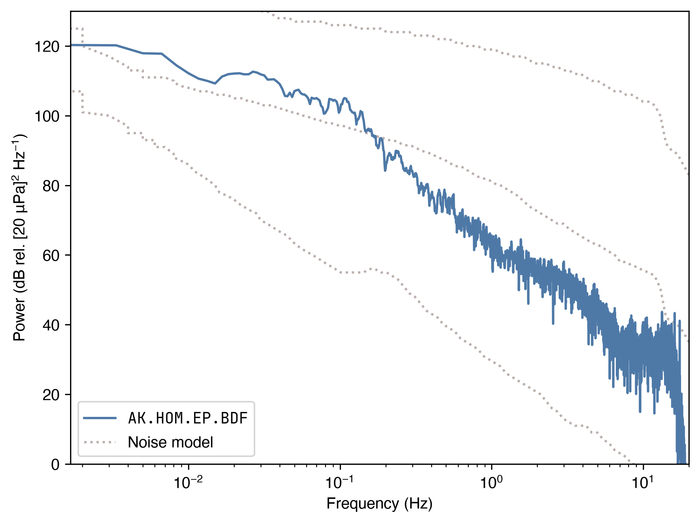

# SAUL

[](https://saul.rtfd.io/)

**SAUL** is the **S**eismo**A**coustic **U**tilities **L**ibrary. It's my take on the
collection of tools that I imagine exist, in some form, on every seismoacoustican's
computer — utilities for gathering waveform data, plotting waveforms in the time and
frequency domain, visualizing key metadata such as station locations, _et cetera._ The
goal of SAUL is to make these fundamental data exploration tools as easy-to-use as
possible. Thus, priority is placed upon straightforward (e.g., easily memorized)
commands and time-saving helper functions — while attempting to leverage existing
dependencies as much as possible to avoid duplicated effort.

> 🚧 **Disclaimer** 🚧  
> As a workhorse "everyday tools" repository, SAUL is currently (perpetually?) under
> rapid development. Expect to encounter breaking changes after a `git pull` update!

## Installing

SAUL is primarily developed on macOS, but it ought to work on Linux — and Windows via
[Windows Subsystem for Linux (WSL)](https://learn.microsoft.com/en-us/windows/wsl/).

This assumes that you've already
[installed uv](https://docs.astral.sh/uv/getting-started/installation/), and that
you've navigated to a project directory of your choosing:
```shell
uv venv --python 3.11
uv pip install git+https://github.com/liamtoney/saul.git
```
This creates a `.venv/` folder in the project directory with SAUL and its dependencies
installed. Activate it with `source .venv/bin/activate`, or prefix commands with
`uv run`.

## Using

Be sure that the environment you've installed SAUL into is activated, or launch Python
with `uv run python`. Here's a simple [usage example](examples/example_psd.py) which
highlights SAUL's object-oriented
interface:
```python
from saul import PSD, Stream

st = Stream.from_earthscope('AK', 'HOM', 'BDF', (2023, 9, 1, 0, 5), (2023, 9, 1, 0, 15))
st.detrend().taper(0.05).remove_response()  # SAUL Stream objects behave like ObsPy's
PSD(st, method='multitaper').plot(show_noise_models=True)
```


For detailed usage information, see the [API documentation](https://saul.rtfd.io/).

## Developing

To develop SAUL, first clone this repository and navigate to the root directory. Then
run:
```shell
uv sync --extra dev --group docs
```
This creates a `.venv/` folder in the repository root with SAUL and all of its
dependencies — including those for development and documentation — installed.
